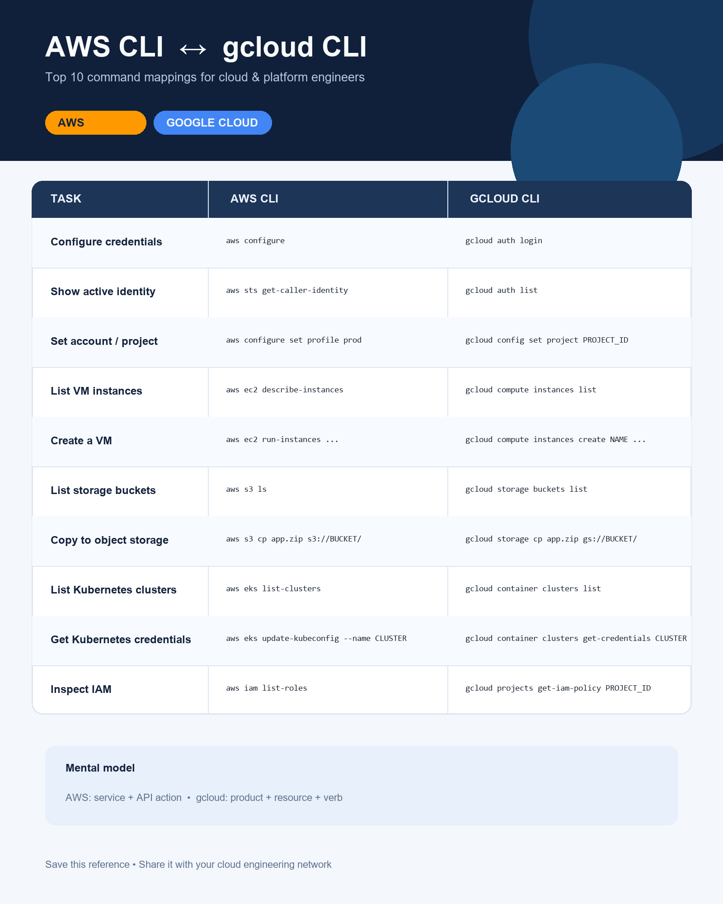

# AWS CLI ↔ gcloud CLI: Top 10 Command Mappings

A visual quick-reference for cloud and platform engineers moving between AWS and Google Cloud.

## Files

- **PNG** — best for social sharing and presentations.
- **SVG** — best for GitHub, web pages, and crisp scaling.

## Quick mental model

- **AWS CLI:** `aws <service> <api-action>`
- **gcloud CLI:** `gcloud <product> <resource> <verb>`

Created by [Mark Sallee](https://github.com/marksallee).
